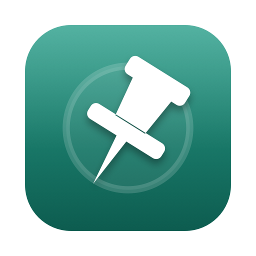

# OpenPin



**Keep a window one click away, as a floating app icon.**

Pin Telegram, Spotify, WhatsApp or any other window. It turns into a small hovering icon that stays above everything else. Click the icon and the window comes out of it, right where the icon is. Click the little pill at the window's corner (or press ⌃⌥P) and it goes back in. That's it.

Made for people who keep one or two windows around all day but don't want them in the way: a chat, a player, a terminal, a reference document.

## Install (2 minutes)

1. Download `OpenPin-…-universal.dmg` from the [latest release](https://github.com/manoelpanev/OpenPin/releases/latest). Works on Apple Silicon and Intel, macOS 14 or newer.
2. Open the DMG and drag **OpenPin** into **Applications**.
3. First launch: right-click OpenPin → **Open** → **Open**. The build is not notarized, so macOS asks once.
4. When OpenPin asks, allow **Accessibility** (System Settings → Privacy & Security → Accessibility). This is what lists windows and moves them.
5. Optional: allow **Screen Recording** only if you want the live preview (right-click an icon → *Live-Ansicht anzeigen*). Nothing is recorded or saved.

Then search for an app in OpenPin, click **Anheften**, and the icon appears at the top right.

## Or let your AI do it

Paste this into ChatGPT, Claude, Copilot or any assistant that can run commands on your Mac:

```text
Install OpenPin on my Mac from https://github.com/manoelpanev/OpenPin/releases/latest:
download the universal DMG, verify it against the .sha256 file, copy OpenPin.app to
/Applications, remove the quarantine flag (xattr -d com.apple.quarantine), launch it,
and open System Settings → Privacy & Security → Accessibility so I can enable OpenPin.
Then tell me in two sentences how to pin a window and how to send it back to its icon.
```

## Using it

| You want to… | Do this |
| --- | --- |
| Pin a window | OpenPin → search the app → **Anheften** |
| Bring the window out | Click its floating icon |
| Put it back into the icon | Click the pill at the window's top-right corner, press **⌃⌥P**, or menu bar → *Fenster zurück ins Symbol* |
| Move the icon | Drag it, on any display |
| See a live preview instead | Right-click the icon → *Live-Ansicht anzeigen* (or ⌘L); *Als Symbol* shrinks it back |
| Unpin | Right-click the icon → *Lösen*, or **Alle lösen** |
| Hide all icons for a while | **Alle pausieren** |

Closing the OpenPin window keeps the icons running; quitting OpenPin stops them. Pins are not restored after quitting.

## Limits

Experimental. Fullscreen and Spaces, system dialogs and apps that ignore accessibility position changes may behave differently. A window larger than the icon's screen is aligned to that screen's edge. The live view is not interactive: clicking it opens the original.

Privacy: everything stays on your Mac. No files are recorded, no audio is captured, nothing is uploaded.

See [TEST-RESULTS.md](TEST-RESULTS.md) for native test evidence and remaining untested cases. Geometry tests alone do not prove a working live stream or correct system window ordering.

## Build

Requires the macOS SDK and Swift compiler. No third-party dependencies. macOS 14 or newer.

```sh
bash scripts/test.sh
bash scripts/build.sh
```

The build requires a valid signing identity. Set `SIGNING_IDENTITY` if more than one is available. When exactly one identity is found, the script uses it and saves its fingerprint in the git-ignored `.signing-identity.local`. Reuse the same identity and bundle identifier for local updates.

```sh
# Explicit experimental distribution build, not notarized:
bash scripts/build.sh --adhoc --universal
bash scripts/package.sh
```

Outputs are `build/OpenPin.app` and `dist/OpenPin-0.4.0-experimental-universal.dmg` for the universal packaging command. Builds are published as [GitHub releases](https://github.com/manoelpanev/OpenPin/releases). The app icon is generated by `scripts/make-icon.swift` (see its header for usage); the rendered `Resources/AppIcon.icns` is checked in.

The bundle identifier remains `local.mrpnv.pinfenster` for local permission continuity. Local Apple Development signing is not Developer ID notarization. Ad-hoc rebuilds may require granting permissions again.

## Implementation

Accessibility identifies the source window by process and geometry. Each pin owns two nonactivating floating panels: a transparent 104-point icon bubble and the live-view panel. The bubble rasterizes the app icon at the display's pixel density and animates a Core Animation hover loop; a spring pop marks its return. Handoff moves the original with the accessibility position attribute, activates the app through Launch Services (a direct activation request is refused when the system does not credit OpenPin with recent user interaction), and raises the window with AXRaise. A short grace period keeps the icon hidden until the target app is in front. While the window is out, a return pill follows its top-right corner (polled every 200 ms through accessibility) and a listen-only global key monitor handles ⌃⌥P; the return hides the app or minimizes the window, then pops the icon back.

ScreenCaptureKit streams the window into an AVSampleBufferDisplayLayer at up to 30 fps with a maximum capture dimension of 1600 pixels. The live view is shown only on request; it grows out of, and shrinks back into, the bubble's top-right corner and stays inside the bubble's screen. All capture objects are stopped on release.

A read-only diagnostic command prints WindowServer metadata:
`build/OpenPin.app/Contents/MacOS/OpenPin --window-order`.
It must run in a session with access to WindowServer. Sandbox-denied access can produce an empty list.

References: [Apple ScreenCaptureKit sample](https://developer.apple.com/documentation/screencapturekit/capturing-screen-content-in-macos), [Apple window collection behavior](https://developer.apple.com/documentation/appkit/nswindow/collectionbehavior-swift.struct/canjoinallspaces), [Apple cooperative activation](https://developer.apple.com/documentation/appkit/nsrunningapplication/activate(from:options:)), [Apple notarization](https://developer.apple.com/documentation/security/notarizing-macos-software-before-distribution).

MIT licensed. See [CONTRIBUTING.md](CONTRIBUTING.md).
